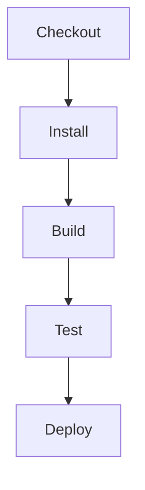

# .github/workflows/build.yml

> Language: text | Size: 1774 bytes

## Model qwen3:8b

### 1. **Purpose Summary**  
This GitHub Actions workflow automates **SonarCloud code analysis** for the `BeerWithFriends-Back-end` repository. It triggers on pushes to the `main` branch or pull request events (opened, synchronized, or reopened). The workflow:  
- Sets up a Java 11 environment (potentially for tooling).  
- Checks out the repository with a full clone (no shallow clone).  
- Caches SonarCloud scanner packages and dependencies to speed up subsequent runs.  
- Installs the SonarCloud scanner if the cache is not available.  
- Builds the project using .NET and runs SonarCloud analysis to detect code quality issues, security vulnerabilities, and maintainability problems.  

---

### 2. **Key Functions/Classes and Collaboration**  
**Key Steps/Components:**  
- **`setup-java`**: Installs JDK 11 (possibly for .NET tooling or legacy dependencies).  
- **`checkout`**: Fetches the full repository codebase.  
- **`cache`**: Manages caching of SonarCloud packages and scanner tools to reduce redundant downloads.  
- **`dotnet-sonarscanner`**: The SonarCloud scanner tool, which:  
  - Begins analysis with project-specific parameters (e.g., `sonar.login`, `sonar.host.url`).  
  - Executes a `.NET build` to analyze code quality.  
  - Ends the analysis session.  
- **`env` variables**:  
  - `GITHUB_TOKEN`: For accessing PR metadata.  
  - `SONAR_TOKEN`: Authenticates SonarCloud API requests.  

**Collaboration Flow:**  
1. **Setup** (JDK, checkout, caching) prepares the environment.  
2. **Scanner installation** ensures the SonarCloud tool is available.  
3. **Build and analysis** runs the .NET build and integrates SonarCloud analysis, leveraging cached dependencies for efficiency.  

---

### 3. **External Dependencies or APIs Used**  
- **SonarCloud API**:  
  - Used via the `dotnet-sonarscanner` tool for code analysis (e.g., `/k` for project key, `/d:sonar.login` for authentication).  
- **GitHub API**:  
  - Accessible via `GITHUB_TOKEN` to fetch PR metadata during pull request events.  
- **.NET SDK**:  
  - Required to build the backend project (implied by `dotnet build`).  
- **GitHub Actions Runtime**:  
  - Provides the Windows VM environment (`windows-latest`) for execution.  

**Note**: The `setup-java` step may be a misconfiguration or leftover artifact, as the project appears to be a .NET backend.

## Detected Imports

None detected.

## Function Diagram

