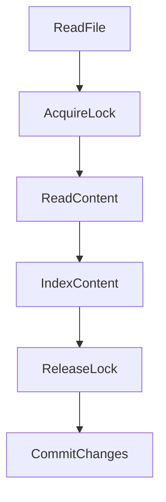

# .vs/BeerWithFriendsBackend/FileContentIndex/read.lock

> Language: text | Size: 0 bytes

## Model qwen3:8b

### 1. **Purpose Summary**  
The `read.lock` file in the `.vs/BeerWithFriendsBackend/FileContentIndex/` directory serves as a **file lock mechanism** to ensure exclusive access to the `FileContentIndex` during read operations. It prevents concurrent modifications to the index file by other processes, ensuring data consistency and avoiding corruption. This is critical in environments where multiple processes or threads might attempt to read/write the same file simultaneously (e.g., during indexing or search operations).

---

### 2. **Key Functions/Classes and Collaboration**  
While the file itself is empty (as lock files typically are), its usage implies the following:  
- **Lock Management**: A class or function (not explicitly shown in the file) likely handles acquiring/releasing the lock by creating/deleting the `read.lock` file.  
  - **Acquire Lock**: Creates the `read.lock` file to block writes.  
  - **Release Lock**: Deletes the `read.lock` file to allow subsequent writes.  
- **Collaboration**:  
  - The `read.lock` file works in tandem with the `FileContentIndex` (likely a file or database storing indexed content) to enforce read exclusivity.  
  - It may be used by background processes (e.g., indexing services) to prevent conflicts when updating the index.  

---

### 3. **External Dependencies or APIs Used**  
- **File System**: Direct interaction with the local file system to create/delete the lock file.  
- **No External APIs**: The file itself does not rely on external libraries or APIs (as indicated by the "Imports detected: None" note).  

---

### Notes  
- The `read.lock` file is a **simple file-based lock**, typical in systems where process-level coordination is required without complex infrastructure.  
- Its absence indicates the index is available for writing, while its presence blocks writes to ensure atomicity during read operations.

## Detected Imports

None detected.

## Function Diagram

