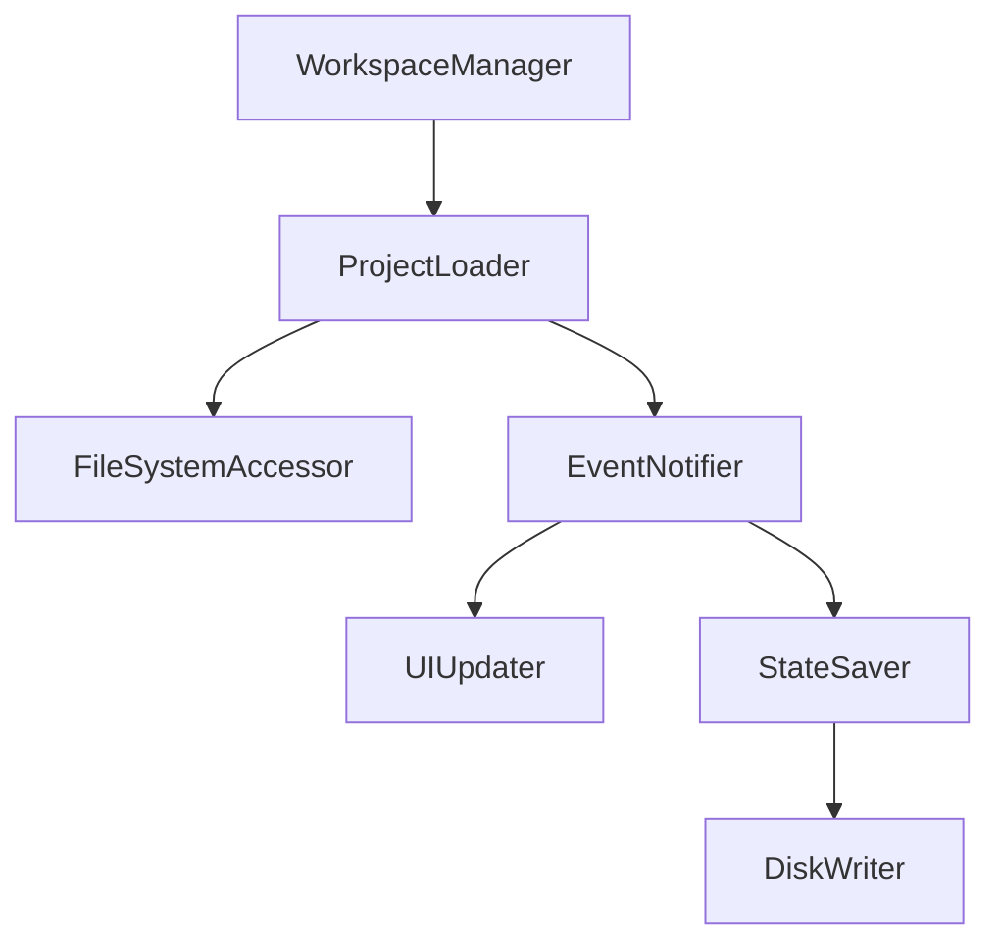

# .vs/VSWorkspaceState.json

> Language: text | Size: 121 bytes

## Model qwen3:8b

### 1. **Purpose Summary**  
The `.vs/VSWorkspaceState.json` file is a Visual Studio workspace state file that tracks the IDE's current workspace configuration. It records:  
- **Expanded nodes**: Which project or folder nodes are expanded in the Solution Explorer (empty here, indicating no expanded nodes).  
- **Selected node**: The file or project currently selected in the workspace (points to `sonar-project.properties`, a SonarQube configuration file).  
- **PreviewInSolutionExplorer**: Whether the "Preview" feature for files is enabled (set to `false`).  

This file helps Visual Studio restore the user's workspace state (e.g., open files, expanded folders) after reopening the solution.  

---

### 2. **Key Functions/Classes and Their Collaboration**  
This file is **not executable code** but a JSON configuration file. It does not contain functions, classes, or direct collaboration between components. However, it interacts with:  
- **Visual Studio IDE**: Stores state data (e.g., selected files, expanded nodes) for the IDE to restore.  
- **Project System**: Links to the `sonar-project.properties` file, which configures SonarQube integration for code quality checks.  

**Collaboration Summary**:  
- The file acts as a metadata bridge between the IDE and the project's configuration files (e.g., `sonar-project.properties`).  
- It ensures the IDE's UI state (e.g., open files, folder views) persists across sessions.  

---

### 3. **External Dependencies or APIs Used**  
- **Visual Studio IDE**: The file is part of Visual Studio's workspace management system.  
- **SonarQube**: The `sonar-project.properties` file (selected as the node) depends on SonarQube for code analysis.  
- **.NET Project System**: The file is used in conjunction with the .NET project structure to manage workspace state.  

**No direct code-level dependencies** (e.g., no external libraries or APIs are invoked via this file).

## Detected Imports

None detected.

## Function Diagram

