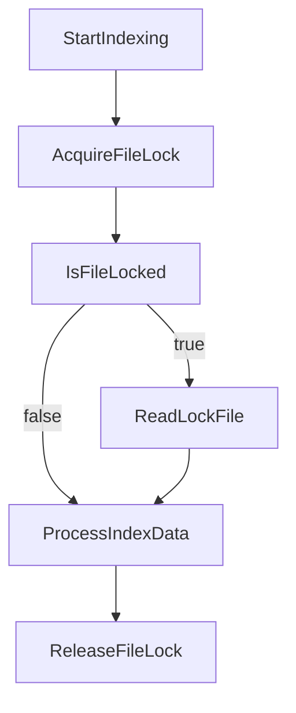

# BeerWithFriendsBackend/.vs/BeerWithFriends-Back-end/FileContentIndex/read.lock

> Language: text | Size: 0 bytes

## Model qwen3:8b

### 1. **Purpose Summary**  
The `read.lock` file in the `FileContentIndex` directory is likely a **lock file** used to manage concurrent access to the file content index. It ensures that only one process or thread can read/write to the index at a time, preventing data corruption or race conditions during indexing operations. This is common in systems where file content is indexed for search, caching, or metadata management.

---

### 2. **Key Functions/Classes and Collaboration**  
- **Lock Management**:  
  - The file itself may not contain code (as it is a plain text lock file), but its presence indicates a mechanism to **block concurrent access** to the `FileContentIndex` (e.g., preventing multiple processes from reading/writing the index simultaneously).  
  - Collaboration involves:  
    - **Indexing Service**: Uses the lock file to acquire/exclude read locks before accessing the index.  
    - **File System**: Manages the lock file's creation, deletion, or modification to enforce access control.  

- **No Code Detected**:  
  - The file appears to be a **simple lock file** (e.g., containing a lock token or marker) rather than executable code. Its role is **metadata-driven** rather than logic-driven.  

---

### 3. **External Dependencies or APIs Used**  
- **None**:  
  - The file does not rely on external libraries, APIs, or services. It operates using **standard file system operations** (e.g., `flock`, `lockfile`, or manual file locking via file I/O).  
  - Any interaction with the file would be handled by the application's file system or process management logic.  

---

### Notes  
- The absence of imports (`Imports detected: None`) confirms this is a **plain text lock file**, not a code module.  
- Its exact behavior depends on the parent system (e.g., Visual Studio's internal indexing tools or custom indexing logic).

## Detected Imports

None detected.

## Function Diagram

