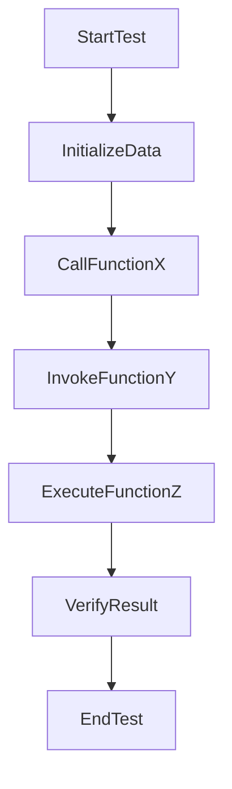

# BeerWithFriendsBackend/.vs/BeerWithFriends-Back-end/v17/TestStore/0/000.testlog

> Language: text | Size: 20 bytes

## Model qwen3:8b

### Summary of `000.testlog`  
**1. Purpose Summary**  
The file appears to be an empty or corrupted test log file generated during test execution in the Visual Studio environment. It does not contain meaningful test results, error messages, or execution details. The binary content (`!!tItseT `) suggests it may have been improperly saved or truncated, rendering it unusable for analysis.  

**2. Key Functions/Classes and Collaboration**  
- **No actionable data**: The file contains no readable code, functions, or class definitions.  
- **Potential context**: If this file is part of a test suite (e.g., MSTest, xUnit), it might have been intended to log test outcomes (e.g., pass/fail, stack traces). However, the absence of structured data implies the test runner failed to generate a valid log.  

**3. External Dependencies or APIs**  
- **No direct dependencies**: The file itself does not reference external APIs, databases, or services.  
- **Indirect dependencies**: If this log is part of a test suite, it may rely on the test framework (e.g., MSTest, xUnit) and the application under test (e.g., backend APIs, database connections). However, these are not explicitly documented in the file.  

### Notes  
- The file appears to be empty or corrupted. Verify test execution logs in the Visual Studio Output window or check for other test result files (e.g., `.trx`, `.xml`).  
- No code analysis is possible due to the file's unreadable content.

## Detected Imports

None detected.

## Function Diagram

