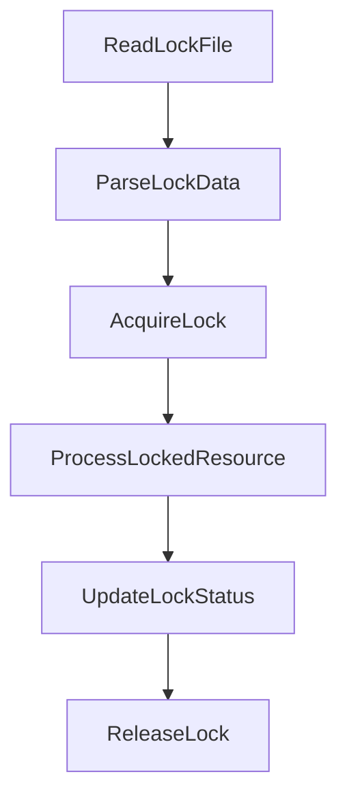

# BeerWithFriendsBackend/.vs/BeerWithFriendsBackend/FileContentIndex/read.lock

> Language: text | Size: 0 bytes

## Model qwen3:8b

### 1. **Purpose Summary**  
The `read.lock` file in the `FileContentIndex` directory is a **file access lock mechanism** used to prevent concurrent modifications to the file content index during read operations. It ensures data consistency by blocking other processes from writing to the file while it is being read, typical in systems requiring exclusive access to file metadata or content during indexing tasks.

---

### 2. **Key Functions/Classes and Their Collaboration**  
While the file itself is a lock file (not executable code), its behavior is governed by the system or framework managing the file content index. Key interactions include:  
- **Lock Acquisition**: A process (e.g., indexing service) attempts to acquire the lock by creating or checking the `read.lock` file.  
- **Lock Release**: After completing the read operation, the lock is released by removing or modifying the `read.lock` file.  
- **Conflict Resolution**: If another process holds the lock, the system may retry, delay, or log an error to handle concurrent access.  

**Collaboration**:  
- The `read.lock` file acts as a **synchronization primitive** between processes, ensuring exclusive read access to the content index.  
- It collaborates with the file content indexing service to enforce atomicity during read operations.  

---

### 3. **External Dependencies or APIs Used**  
- **No explicit imports or APIs** are detected in the file itself.  
- The lock mechanism likely relies on **operating system-level file locking** (e.g., `flock` in Unix, file-based locks in Windows) or **framework-specific utilities** (e.g., .NET `FileLock`, Python `filelock` library).  
- The file is part of the **Visual Studio project system** (`.vs/` directory), suggesting it may interact with Visual Studio's internal file indexing or caching mechanisms.  

--- 

**Note**: Since the file is a lock file (not executable code), its "functions" are implicit in the system's file handling logic rather than explicit code.

## Detected Imports

None detected.

## Function Diagram

