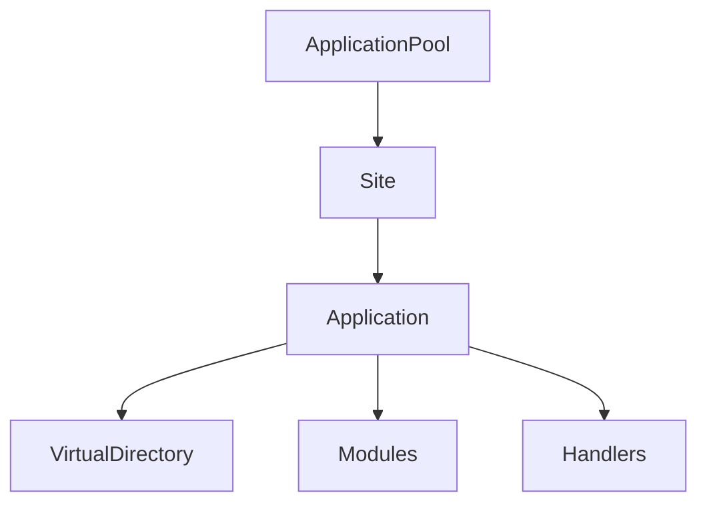

# BeerWithFriendsBackend/.vs/BeerWithFriendsBackend/config/applicationhost.config

> Language: text | Size: 75703 bytes

## Model qwen3:8b

### 1. **Purpose Summary**  
The `applicationhost.config` file is an **IIS (Internet Information Services) configuration file** used to define and manage the runtime settings for the BeerWithFriendsBackend service. It configures critical aspects of the IIS server, such as application pools, website bindings, security policies, request handling, and module configurations. This file ensures the backend service runs correctly within the IIS environment, including settings for URL rewriting, compression, authentication, and logging.

---

### 2. **Key Functions/Classes and Their Collaboration**  
While this file is an XML configuration file and does not contain executable code, it defines **IIS configuration sections** that act as logical components for managing the server. Key sections include:  

- **`<applicationPools>`**: Manages application pools (e.g., recycling settings, .NET CLR versions).  
- **`<sites>`**: Defines website configurations (e.g., bindings, physical paths, application settings).  
- **`<security>`**: Configures authentication/authorization rules (e.g., `windowsAuthentication`, `requestFiltering`).  
- **`<httpCompression>`**: Enables GZIP/DEFLATE compression for responses.  
- **`<rewrite>`**: Defines URL rewrite rules for routing requests.  
- **`<httpErrors>`**: Customizes error pages (e.g., 404, 500).  
- **`<modules>`/`<globalModules>`**: Registers IIS modules (e.g., URL rewriting, logging).  

**Collaboration**: These sections work together to define how the IIS server processes HTTP requests, secures endpoints, optimizes performance, and handles errors. For example, the `<rewrite>` section collaborates with `<modules>` to route traffic to the backend service, while `<security>` ensures only authorized users access the API.

---

### 3. **External Dependencies or APIs Used**  
- **IIS Server**: The configuration is specific to IIS (e.g., `applicationPools`, `sites`, `httpCompression`).  
- **IIS Modules**: Features like URL rewriting (`<rewrite>`), logging (`<httpLogging>`), and compression (`<httpCompression>`) rely on IIS modules.  
- **Windows Authentication**: If enabled, depends on Windows security APIs for user validation.  
- **System File System**: Physical paths defined in `<sites>` (e.g., `%IIS_SITES_HOME%`) reference the file system.  
- **Environment Variables**: Uses variables like `%IIS_SITES_HOME%` and `%SYSTEMDRIVE%` to locate configuration files or binaries.  

**Note**: This file does not directly interact with external APIs (e.g., REST endpoints) but sets up the infrastructure for the backend service to operate within IIS.

## Detected Imports

None detected.

## Function Diagram

