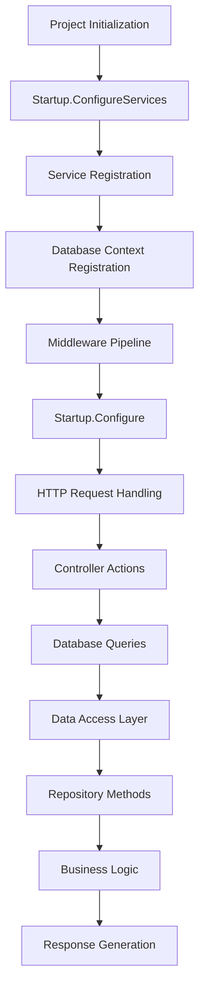

# BeerWithFriendsBackend/BeerWithFriendsBackend/BeerWithFriendsBackend.csproj

> Language: text | Size: 1047 bytes

## Model qwen3:8b

### 1. **Purpose Summary**  
The `BeerWithFriendsBackend.csproj` file defines a **.NET 6.0 ASP.NET Core Web API project** for the "BeerWithFriends" backend application. It sets up the project structure, target framework, nullable reference types, and includes essential packages for **database operations (Entity Framework Core)**, **API documentation (Swagger)**, and **security analysis**. The project is designed to handle backend logic for a social beer-drinking application, likely involving user management, event tracking, and data persistence.

---

### 2. **Key Functions/Classes and Collaboration**  
- **Core Components**:  
  - **Entity Framework Core (EF Core)**: Manages database interactions via `Microsoft.EntityFrameworkCore.SqlServer` and `Microsoft.EntityFrameworkCore.Tools`.  
  - **API Controllers**: Likely handle HTTP requests (e.g., CRUD operations for users, events, or beer logs).  
  - **Services/Repositories**: Mediate between controllers and the database, encapsulating business logic.  
  - **Swagger (Swashbuckle.AspNetCore)**: Generates API documentation for endpoints, enabling developers to test and explore the API.  

- **Collaboration Flow**:  
  - **Controllers** receive HTTP requests, delegate to **services** (e.g., `UserService`, `EventService`).  
  - **Services** use **repositories** (e.g., `UserRepository`) to interact with the database via EF Core.  
  - **Swagger** integrates with controllers to auto-generate documentation for all endpoints.  

---

### 3. **External Dependencies or APIs Used**  
- **Microsoft.EntityFrameworkCore.SqlServer**: Enables SQL Server database operations for data persistence.  
- **Swashbuckle.AspNetCore**: Provides Swagger/OpenAPI integration for API documentation.  
- **SecurityCodeScan.VS2019**: A security analysis tool to detect vulnerabilities in the codebase.  
- **Microsoft.EntityFrameworkCore.Tools**: Facilitates database migrations and scaffolding for EF Core.  

**Note**: The project does not explicitly reference external APIs (e.g., third-party services) beyond the listed NuGet packages. All functionality is likely self-contained within the backend logic.

## Detected Imports

None detected.

## Function Diagram

