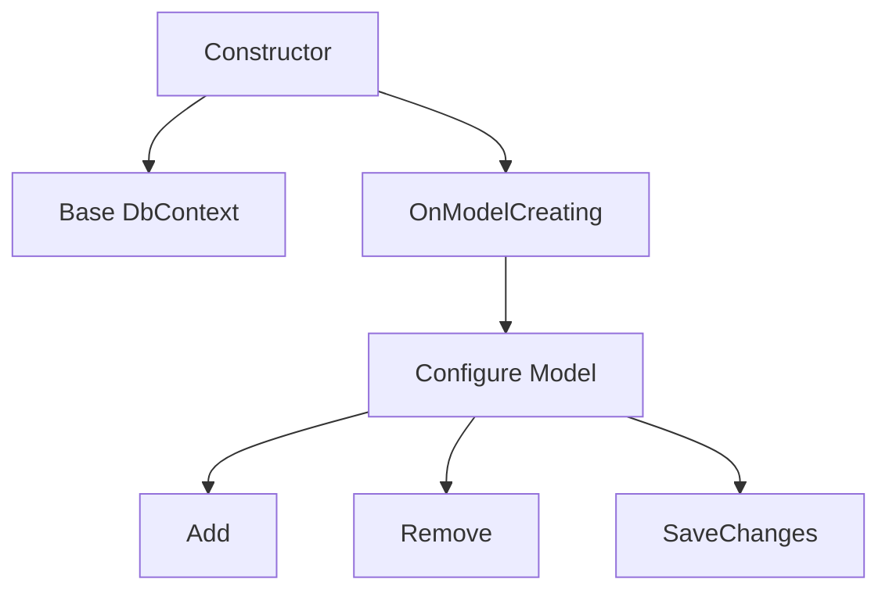

# BeerWithFriendsBackend/BeerWithFriendsBackend/Data/BeerWithFriendsBackendContext.cs

> Language: text | Size: 549 bytes

## Model qwen3:8b

### 1. **Purpose Summary**  
The `BeerWithFriendsBackendContext` class serves as the **primary database context** for the `BeerWithFriendsBackend` application. It enables interaction with the database using **Entity Framework Core (EF Core)**, defining the data models (`Beer` and `Review`) and their relationships. This class is responsible for managing database connections, querying data, and persisting changes to the database.

---

### 2. **Key Functions/Classes and Collaboration**  
- **`BeerWithFriendsBackendContext` Class**:  
  - Inherits from `Microsoft.EntityFrameworkCore.DbContext`, providing the foundation for database operations.  
  - **Constructor**: Accepts `DbContextOptions<BeerWithFriendsBackendContext>` to configure the database connection.  
  - **DbSets**:  
    - `DbSet<Beer> Beer`: Represents the `Beer` table in the database, allowing CRUD operations.  
    - `DbSet<Review> Review`: Represents the `Review` table, enabling querying and saving reviews.  

- **Collaboration**:  
  - The `Beer` and `Review` entities (defined in the `Models` namespace) are mapped to database tables via the `DbSet` properties.  
  - EF Core uses these `DbSet` properties to translate LINQ queries into SQL commands and manage data persistence.

---

### 3. **External Dependencies or APIs Used**  
- **Microsoft.EntityFrameworkCore**: The core library for EF Core, enabling ORM capabilities (e.g., database connection management, query translation).  
- **Models Namespace**: Contains the `Beer` and `Review` entity classes, which are mapped to database tables via the `DbSet` properties.  

**Note**: While the file does not explicitly reference external APIs (e.g., third-party services), it relies on **Entity Framework Core** (a Microsoft library) and the internal `Models` namespace for data modeling.

## Detected Imports

None detected.

## Function Diagram

