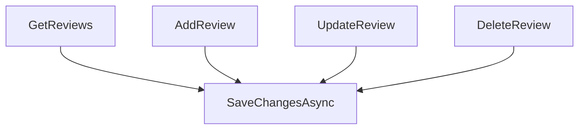

# BeerWithFriendsBackend/BeerWithFriendsBackend/Data/ReviewData.cs

> Language: text | Size: 586 bytes

## Model qwen3:8b

### 1. **Purpose Summary**  
The `ReviewData` class in `ReviewData.cs` serves as a data access layer for managing review-related operations. It provides functionality to retrieve reviews associated with a specific beer (via `BeerId`) and to add new reviews to the database. This class acts as a bridge between the application logic and the underlying database using Entity Framework Core.

---

### 2. **Key Functions/Classes and Their Collaboration**  
- **`ReviewData` Class**  
  - **Role**: Manages database interactions for reviews.  
  - **Collaboration**:  
    - Depends on `BeerWithFriendsBackendContext` (a `DbContext` instance) to access the database.  
    - Uses LINQ queries and Entity Framework Core's `SaveChanges` method to persist data.  

- **Key Methods**  
  - **`Reviews(int id)`**  
    - **Purpose**: Retrieves all reviews for a beer with the specified `BeerId`.  
    - **Collaboration**: Uses `_context.Review` (a `DbSet<Review>`) to filter and return reviews.  
  - **`AddReview(Review review)`**  
    - **Purpose**: Adds a new review to the database.  
    - **Collaboration**: Adds the `Review` entity to the context and calls `SaveChanges()` to commit the transaction.  

- **`BeerWithFriendsBackendContext`**  
  - **Role**: Represents the database context, enabling interaction with the `Review` table via `DbSet<Review>`.  
  - **Collaboration**: Provides the underlying data access layer for `ReviewData`.  

---

### 3. **External Dependencies or APIs Used**  
- **Entity Framework Core**  
  - The class relies on EF Core for database operations (e.g., querying, adding entities).  
  - Uses `BeerWithFriendsBackendContext` (a `DbContext`) to interact with the database.  
- **No External APIs**: The file does not use third-party APIs or external services.  
- **Internal Dependencies**:  
  - `Review` class (from `Models` namespace) for data modeling.  
  - `BeerWithFriendsBackendContext` (internal to the project) for database connectivity.  

--- 

**Note**: The file assumes the existence of a `Review` entity and a `BeerWithFriendsBackendContext` configured with a `DbSet<Review>`.

## Detected Imports

None detected.

## Function Diagram

