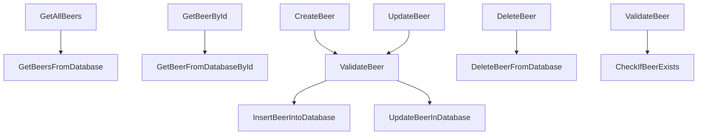

# BeerWithFriendsBackend/BeerWithFriendsBackend/Logic/BeerLogic.cs

> Language: text | Size: 1248 bytes

## Model qwen3:8b

### 1. **Purpose Summary**  
The `BeerLogic` class serves as the business logic layer for managing beer-related operations in the BeerWithFriends backend application. It acts as an intermediary between the data access layer (`BeerData`) and the application, handling CRUD (Create, Read, Update, Delete) operations for beer entities while enforcing basic validation (e.g., ensuring non-negative alcohol percentages).  

---

### 2. **Key Functions/Classes and Collaboration**  
- **`BeerLogic` Class**:  
  - **Constructor**: Accepts an instance of `BeerData` (data access layer) for dependency injection.  
  - **Public Methods**:  
    - `Beers()`: Retrieves all beers by delegating to `_beerData.Beers()`.  
    - `Beer(int id)`: Fetches a specific beer by ID using `_beerData.Beer(id)`.  
    - `NewBeer(Beer beer)`: Validates the beer's alcohol percentage (via `CheckNegativeAlcoholPercentage`) and persists it using `_beerData.NewBeer(beer)`.  
    - `DeleteBeer(int id)`: Deletes a beer by ID via `_beerData.DeleteBeer(id)`.  
    - `EditBeer(Beer beer)`: Updates an existing beer via `_beerData.EditBeer(beer)`.  
  - **Private Helper**:  
    - `CheckNegativeAlcoholPercentage(Beer beer)`: Validates that the beer's alcohol percentage is non-negative.  

- **Collaboration**:  
  - `BeerLogic` relies on `BeerData` to interact with the database (e.g., CRUD operations).  
  - `Beer` model objects are passed between logic and data layers to represent beer entities.  

---

### 3. **External Dependencies or APIs Used**  
- **`BeerData`**: The data access layer responsible for database operations (e.g., querying, inserting, updating, deleting beers).  
- **`Beer` Model**: Represents the beer entity with properties like `Id`, `Name`, `AlcoholPercentage`, etc.  
- **No External APIs**: The code does not use external services or APIs; it operates within the application's internal data model.  

--- 

**Note**: The absence of explicit `using` directives suggests `BeerData` and `Beer` are either in the same namespace or part of the project's internal structure.

## Detected Imports

None detected.

## Function Diagram

