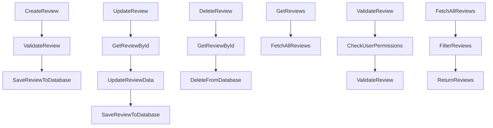

# BeerWithFriendsBackend/BeerWithFriendsBackend/Logic/ReviewLogic.cs

> Language: text | Size: 535 bytes

## Model qwen3:8b

### 1. **Purpose Summary**  
The `ReviewLogic` class serves as a mediator between the application's business logic and the data layer. It encapsulates operations for managing reviews, such as retrieving reviews by a specific entity (e.g., a beer or user) and adding new reviews. This class ensures separation of concerns by delegating data access to the `ReviewData` class, maintaining a clean architecture.

---

### 2. **Key Functions/Classes and Collaboration**  
- **Class**: `ReviewLogic`  
  - **Role**: Acts as a logic layer to handle review-related operations.  
  - **Collaboration**:  
    - **`ReviewData`**: The data access layer (via dependency injection) provides methods to retrieve and persist reviews.  
    - **`Review` Model**: Represents the data structure for reviews, used as input/output in methods.  

- **Key Methods**:  
  - **`Reviews(int id)`**:  
    - **Purpose**: Fetches a list of reviews associated with the given `id` (e.g., a beer or user ID).  
    - **Collaboration**: Calls `_reviewData.Reviews(id)` to retrieve data.  
  - **`AddReview(Review review)`**:  
    - **Purpose**: Adds a new review to the system.  
    - **Collaboration**: Invokes `_reviewData.AddReview(review)` to persist the review.  

---

### 3. **External Dependencies or APIs Used**  
- **`ReviewData` Class**:  
  - Located in the `BeerWithFriendsBackend.Data` namespace.  
  - Provides concrete implementations for data operations (e.g., querying a database, saving entities).  
- **No External APIs**: The file does not interact with external services or APIs, relying solely on internal data access logic.  

---

### Notes  
- **Dependency Injection**: The `ReviewData` instance is injected via the constructor, enabling testability and decoupling of layers.  
- **Simplicity**: The class focuses on minimal business logic, offloading data operations to the `ReviewData` class.

## Detected Imports

None detected.

## Function Diagram

