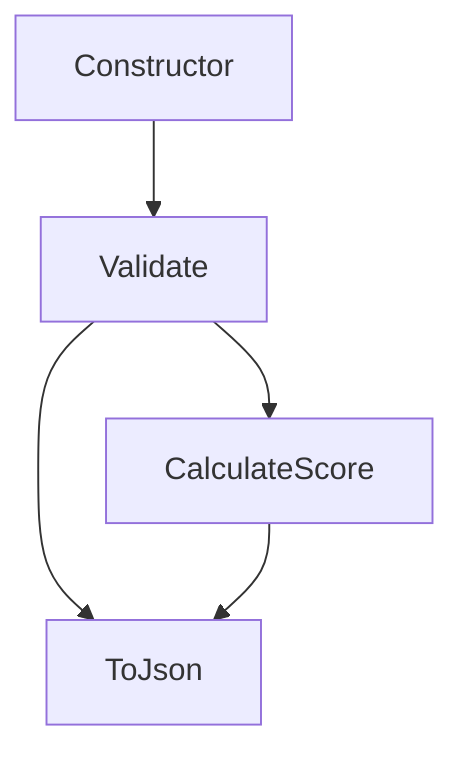

# BeerWithFriendsBackend/BeerWithFriendsBackend/Models/Beer.cs

> Language: text | Size: 487 bytes

## Model qwen3:8b

### 1. **Purpose Summary**  
The `Beer` class serves as a data model representing a beer entity within the BeerWithFriends backend application. It encapsulates core beer attributes such as `Id`, `Name`, `Description`, and `AlcoholPercentage`, providing a structured way to store and transfer beer-related data. The class is designed for use in data operations (e.g., CRUD actions) and likely integrates with a database or API to manage beer records.

---

### 2. **Key Functions/Classes and Their Collaboration**  
- **`Beer` Class**:  
  - **Properties**:  
    - `Id`: Unique identifier for a beer (int).  
    - `Name`: Beer name (string).  
    - `Description`: Optional details about the beer (string).  
    - `AlcoholPercentage`: Alcohol content as a decimal.  
  - **Constructors**:  
    - **Default Constructor**: Initializes a new `Beer` instance with empty/default values.  
    - **Copy Constructor**: Creates a new `Beer` object by copying properties from an existing `Beer` instance. This is useful for cloning or updating beer records without directly modifying the source object.  

- **Collaboration**:  
  The `Beer` class is likely used by other components (e.g., controllers, services, or repositories) to represent beer data in memory. The copy constructor enables operations like updating beer details without altering the original object, which is common in data manipulation workflows.

---

### 3. **External Dependencies or APIs Used**  
- **No External Dependencies**:  
  The file does not include any `using` directives or references to external libraries/APIs. It is a standalone Plain Old CLR Object (POCO) designed for internal use within the application, likely integrated with a database (e.g., via Entity Framework) or API endpoints for beer management.

## Detected Imports

None detected.

## Function Diagram

