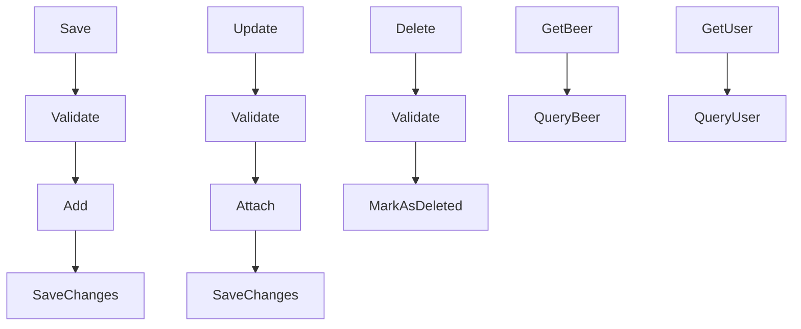

# BeerWithFriendsBackend/BeerWithFriendsBackend/Models/Review.cs

> Language: text | Size: 457 bytes

## Model qwen3:8b

### 1. **Purpose Summary**  
The `Review` class represents a review for a beer in the BeerWithFriends application. It stores metadata about a review, including a unique identifier (`Id`), the beer it refers to (`BeerId`), a textual comment (`Comment`), and a numerical rating (`Rating`). This class serves as a data model for capturing user feedback on beers.

---

### 2. **Key Functions/Classes and Their Collaboration**  
- **`Review` Class**:  
  - **Properties**:  
    - `Id`: Unique identifier for the review.  
    - `BeerId`: Foreign key linking the review to a specific beer.  
    - `Comment`: Textual feedback from the user.  
    - `Rating`: Numerical score (likely 1–5) for the beer.  
  - **Constructors**:  
    - **Default Constructor**: Initializes a new `Review` instance with no parameters.  
    - **Copy Constructor**: Creates a new `Review` by copying properties from an existing `Review` object.  

**Collaboration**:  
The `Review` class is a simple data model used to represent reviews. Its properties and constructors enable creation and duplication of review records, likely for storage in a database or API response. No other classes are directly referenced in this file.

---

### 3. **External Dependencies or APIs Used**  
- **No external dependencies**: The file does not include any `using` directives or API integrations.  
- **Implied Dependencies**:  
  While not explicitly stated, the `Review` class is likely used in conjunction with a database (e.g., via Entity Framework) to persist reviews. However, this is inferred from the context of the project rather than the file itself.

## Detected Imports

None detected.

## Function Diagram

