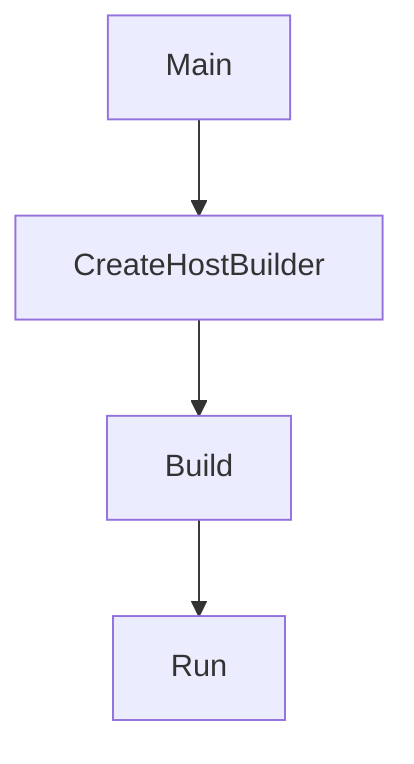

# BeerWithFriendsBackend/BeerWithFriendsBackend/Program.cs

> Language: text | Size: 1524 bytes

## Model qwen3:8b

### 1. **Purpose Summary**  
The `Program.cs` file serves as the entry point for the **BeerWithFriendsBackend** ASP.NET Core application. It configures the backend services, database context, middleware, and API endpoints. Key responsibilities include:  
- Setting up **Entity Framework Core (EF Core)** for SQL Server database interactions.  
- Enabling **CORS** for cross-origin API requests.  
- Registering transient services for **data access** (`BeerData`, `ReviewData`) and **business logic** (`BeerLogic`, `ReviewLogic`).  
- Configuring **Swagger/OpenAPI** for API documentation.  
- Defining the HTTP request pipeline with middleware for development tools, HTTPS redirection, authorization, and routing.  

---

### 2. **Key Functions/Classes and Collaboration**  
**Main Components**:  
- **`WebApplicationBuilder`**: Central configuration hub for services, middleware, and dependencies.  
- **`BeerWithFriendsBackendContext`**: EF Core database context for SQL Server, configured with retry policies for resilience.  
- **Transient Services**:  
  - **`BeerData` / `BeerLogic`**: Handle beer-related data access and business logic.  
  - **`ReviewData` / `ReviewLogic`**: Manage review data and associated logic.  
- **Middleware**:  
  - **Swagger**: Enables API documentation for development.  
  - **CORS**: Allows cross-origin requests (configured to permit any origin, method, and header).  
  - **Authorization**: Enforces authentication/authorization rules.  
  - **Routing**: Maps controllers to API endpoints via `app.MapControllers()`.  

**Collaboration Flow**:  
1. **EF Core** is configured with a SQL Server connection string and retry logic for transient failures.  
2. **Transient services** are registered to resolve dependencies for data and logic layers.  
3. **Middleware** is added to handle development tools (Swagger), security (HTTPS, authorization), and CORS.  
4. **Controllers** are mapped to handle HTTP requests, leveraging the registered services for business logic.  

---

### 3. **External Dependencies or APIs Used**  
- **Microsoft.EntityFrameworkCore**: For ORM-based SQL Server database operations.  
- **Microsoft.AspNetCore.Cors**: Enables Cross-Origin Resource Sharing (CORS) for frontend-backend communication.  
- **Microsoft.AspNetCore.Mvc**: Provides MVC framework for API controllers.  
- **SQL Server**: Backend database via Entity Framework Core (connection string from `appsettings.json`).  
- **Swagger/OpenAPI**: For API documentation and testing (via `Swashbuckle`).  

**Note**: The connection string `BeersCon` is sourced from the app's configuration (`builder.Configuration.GetConnectionString`), which is typically defined in `appsettings.json` or environment variables.

## Detected Imports

None detected.

## Function Diagram

