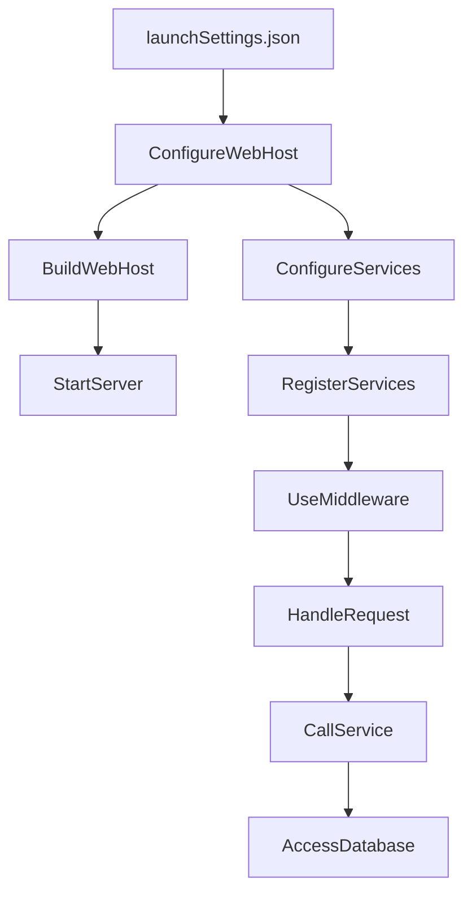

# BeerWithFriendsBackend/BeerWithFriendsBackend/Properties/launchSettings.json

> Language: text | Size: 820 bytes

## Model qwen3:8b

### 1. **Purpose Summary**  
The `launchSettings.json` file configures the development environment for the **BeerWithFriendsBackend** application. It defines:  
- **Startup URLs**: Specifies the HTTP/HTTPS endpoints where the app runs (e.g., `https://localhost:7064`).  
- **Authentication Settings**: Enables **anonymous authentication** (no login required) and disables Windows authentication for development.  
- **Environment**: Sets the environment to **Development** to enable debug features (e.g., detailed error messages).  
- **Browser Launch**: Automatically opens the Swagger UI (`/swagger`) for API testing when the app starts.  
- **Hosting Options**: Provides two profiles:  
  - **DotNet CLI**: Runs the app directly using `dotnet run`.  
  - **IIS Express**: Hosts the app via IIS Express with a custom SSL port (44378).  

---

### 2. **Key Functions/Classes and Collaboration**  
- **Profiles**:  
  - **`BeerWithFriendsBackend`**:  
    - Uses the `Project` command to launch the app.  
    - Sets `applicationUrl` to `https://localhost:7064;http://localhost:5008` (dual protocol support).  
    - Triggers the browser to open Swagger UI (`/swagger`).  
  - **`IIS Express`**:  
    - Uses the `IISExpress` command to host the app via IIS Express.  
    - Shares the same `applicationUrl` and environment variables as the `BeerWithFriendsBackend` profile.  
- **Collaboration**:  
  - Both profiles share the same environment (`Development`) and Swagger endpoint, ensuring consistent behavior during development.  
  - The `iisSettings` section configures IIS Express (application URL, SSL port), while the `profiles` section defines how the app is launched (directly or via IIS).  

---

### 3. **External Dependencies or APIs Used**  
- **Swagger UI**:  
  - Embedded in ASP.NET Core for API documentation and testing.  
  - Automatically opened at `https://localhost:7064/swagger` when the app starts.  
- **IIS Express**:  
  - Microsoft's lightweight web server for hosting ASP.NET Core apps during development.  
- **ASP.NET Core Runtime**:  
  - Required to run the backend, with environment variables (`ASPNETCORE_ENVIRONMENT`) controlling behavior (e.g., Development mode).  
- **No External APIs**:  
  - The file does not reference external services or APIs; it focuses on local hosting and development configuration.  

---  
**Note**: This file does not include code logic but serves as a configuration blueprint for the backend's development environment.

## Detected Imports

None detected.

## Function Diagram

