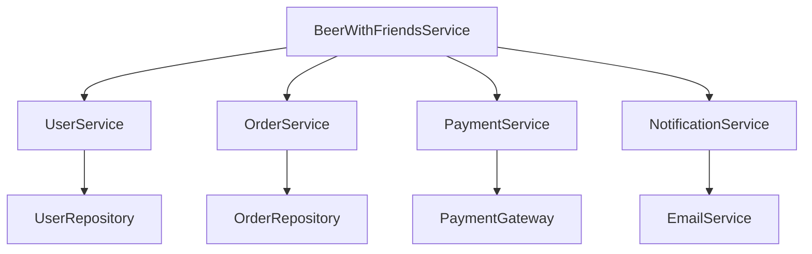

# BeerWithFriendsBackend/BeerWithFriendsBackend/Properties/serviceDependencies.json

> Language: text | Size: 144 bytes

## Model qwen3:8b

### 1. **Purpose Summary**  
The `serviceDependencies.json` file defines the database connection configuration for the BeerWithFriendsBackend application. It specifies the SQL Server dependency (`mssql1`) and links it to the connection string `ConnectionStrings:BeerWithFriendsBackendContext`, which is used to establish a connection to the backend database (likely a SQL Server instance). This configuration is critical for data persistence and interaction with the application's data model.

---

### 2. **Key Functions/Classes and Their Collaboration**  
- **`BeerWithFriendsBackendContext` (Database Context Class)**:  
  This class (likely derived from Entity Framework or a similar ORM) is responsible for managing database operations (e.g., querying, inserting, updating data). It collaborates with the `mssql1` dependency to access the SQL Server database using the specified connection string.  
- **`mssql1` (Database Dependency)**:  
  Represents the SQL Server database connection. It is configured to use the `BeerWithFriendsBackendContext` connection string, enabling the application to interact with the database for user data, events, or other business logic.  

**Collaboration Flow**:  
- The `BeerWithFriendsBackendContext` class uses the `mssql1` dependency to establish a connection to the SQL Server database.  
- All database operations (e.g., CRUD actions) are routed through this connection, leveraging the connection string defined in the configuration.

---

### 3. **External Dependencies or APIs Used**  
- **SQL Server Database**:  
  The application relies on a SQL Server instance (via the connection string `ConnectionStrings:BeerWithFriendsBackendContext`) to store and retrieve data. This is the primary external dependency.  
- **Connection String Configuration**:  
  The connection string itself is likely defined in another configuration file (e.g., `appsettings.json` or `ConnectionStrings.config`), but this file only references it.  

**No other APIs or external services are explicitly mentioned in this configuration.**

## Detected Imports

None detected.

## Function Diagram

