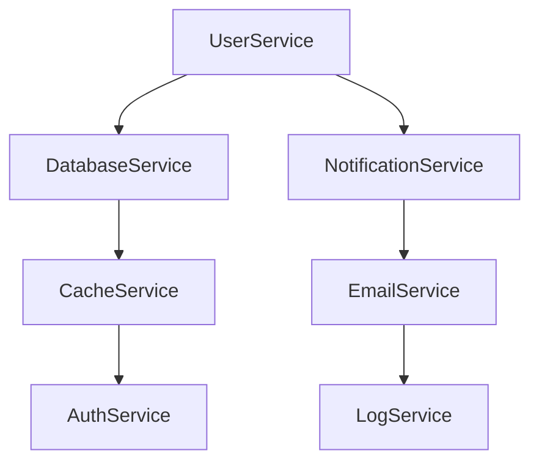

# BeerWithFriendsBackend/BeerWithFriendsBackend/Properties/serviceDependencies.local.json

> Language: text | Size: 150 bytes

## Model qwen3:8b

### 1. **Purpose Summary**  
The `serviceDependencies.local.json` file configures the local SQL Server database dependency for the `BeerWithFriendsBackend` application. It specifies the connection details for the backend's database context, enabling the application to interact with a local SQL Server instance. This file is critical for setting up the database connection during local development or testing.

---

### 2. **Key Functions/Classes and Their Collaboration**  
- **Database Context Class**:  
  The backend likely uses a `DbContext` class (e.g., `BeerWithFriendsBackendContext`) to manage database operations. This class collaborates with the SQL Server dependency defined in `serviceDependencies.local.json` to establish a connection to the local database.  
- **Dependency Injection**:  
  The `mssql1` dependency is injected into the application's service container, allowing the `DbContext` to resolve the connection string at runtime. The `connectionId` references the `ConnectionStrings:BeerWithFriendsBackendContext` entry in the app configuration, which contains the actual SQL Server connection details.  

**Collaboration Flow**:  
`BeerWithFriendsBackendContext` → Resolves `mssql1` dependency → Uses `ConnectionStrings:BeerWithFriendsBackendContext` to connect to the local SQL Server instance.

---

### 3. **External Dependencies or APIs Used**  
- **Local SQL Server Instance**:  
  The backend relies on a local SQL Server database running on the developer's machine. The connection string in `ConnectionStrings:BeerWithFriendsBackendContext` points to this instance, which is managed externally (e.g., via Docker, SQL Server Express, or a local installation).  
- **Configuration System**:  
  The connection string itself is sourced from the application's configuration (e.g., `appsettings.json` or environment variables), which is referenced by the `connectionId` in the dependency definition.  

**Note**: No external APIs (e.g., RESTful services, third-party tools) are explicitly mentioned in this file. The sole dependency is the local SQL Server database.

## Detected Imports

None detected.

## Function Diagram

