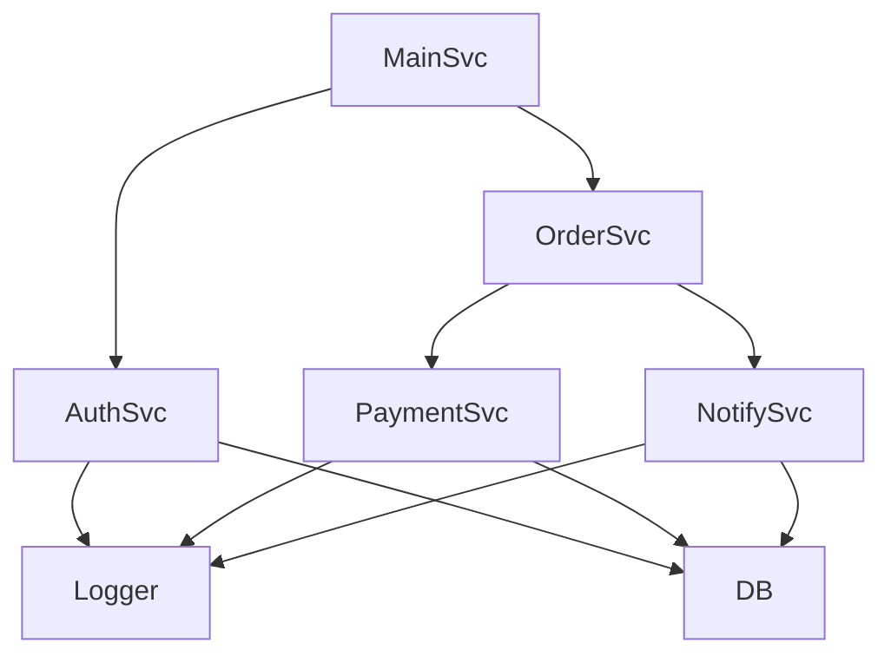

# BeerWithFriendsBackend/BeerWithFriendsBackend/Properties/serviceDependencies.local.json.user

> Language: text | Size: 145 bytes

## Model qwen3:8b

### 1. **Purpose Summary**  
This file documents the restoration status of a Microsoft SQL Server database (`mssql1`) used by the `BeerWithFriendsBackend` application. It serves as a record of when the database was restored (December 12, 2022) and confirms its availability for the backend service. The file is likely part of a deployment or setup process to track database dependencies in a local or staging environment.

---

### 2. **Key Functions/Classes and Their Collaboration**  
- **No code is present** in this file; it is a static JSON configuration.  
- **Collaboration context**:  
  - The `mssql1` database is a critical dependency for the backend service, likely used to store user data, events, or application state.  
  - The backend service (e.g., API controllers, data access layers) collaborates with this database via connection strings or ORM tools (e.g., Entity Framework, Dapper).  
  - The `restored` flag and `restoreTime` indicate that the database was successfully initialized, enabling the backend to function without requiring manual setup.

---

### 3. **External Dependencies or APIs Used**  
- **Microsoft SQL Server (mssql1)**: The primary external dependency. The backend service relies on this database for persistent storage.  
- **No APIs are explicitly referenced** in this file, but the backend likely interacts with other services (e.g., authentication, payment gateways) indirectly via APIs, though those are not documented here.  

---

### Notes  
- The file appears to be a **local configuration** for tracking database restoration, possibly used in CI/CD pipelines or local development environments.  
- The empty `parameters` section suggests it may be extended in the future for additional configuration options.

## Detected Imports

None detected.

## Function Diagram

