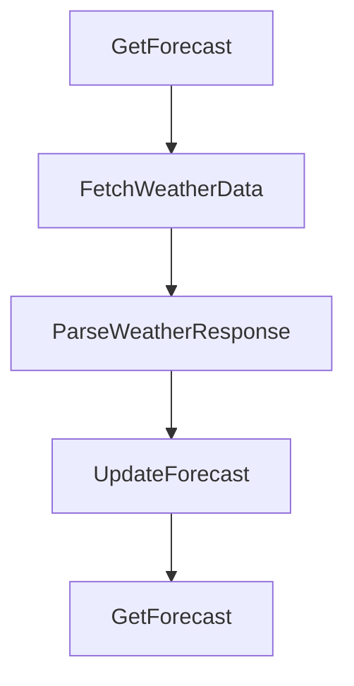

# BeerWithFriendsBackend/BeerWithFriendsBackend/WeatherForecast.cs

> Language: text | Size: 288 bytes

## Model qwen3:8b

### 1. Purpose Summary  
The `WeatherForecast` class models weather forecast data, encapsulating key properties such as date, temperature in Celsius, derived Fahrenheit temperature, and a summary description. It serves as a data structure for representing weather information within the BeerWithFriends backend application, likely used for displaying forecasts to users or integrating with external services.

---

### 2. Key Functions/Classes and Their Collaboration  
- **Class**: `WeatherForecast`  
  - **Properties**:  
    - `Date`: Represents the date of the forecast.  
    - `TemperatureC`: Stores temperature in Celsius.  
    - `TemperatureF`: A **calculated property** derived from `TemperatureC` using the formula `32 + (int)(TemperatureC / 0.5556)` to convert Celsius to Fahrenheit.  
    - `Summary`: A string describing the weather condition (e.g., "Sunny", "Rainy").  
  - **Collaboration**:  
    - The class acts as a simple data container, with `TemperatureF` automatically computed from `TemperatureC`.  
    - It likely interacts with other components (e.g., APIs, UI layers) to pass weather data for display or processing.  

---

### 3. External Dependencies or APIs Used  
- **No external dependencies**: The file does not reference any APIs, libraries, or external services.  
- **Internal Use**: The class is self-contained and may be used to structure data for internal processing, such as storing forecasts in a database or passing to frontend components.  

---  
**Note**: While the class itself does not use external APIs, its purpose suggests it could integrate with weather services (e.g., OpenWeatherMap) in a broader system, though this is not reflected in the provided code.

## Detected Imports

None detected.

## Function Diagram

