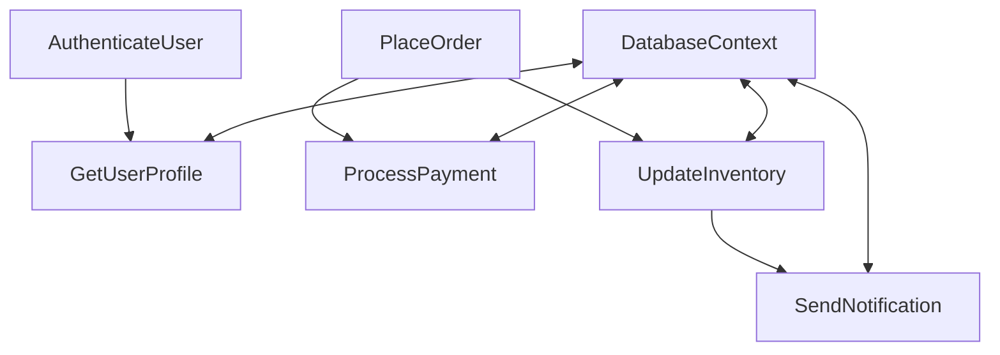

# BeerWithFriendsBackend/BeerWithFriendsBackend/appsettings.Development.json

> Language: text | Size: 119 bytes

## Model qwen3:8b

1. **Purpose Summary**  
   This `appsettings.Development.json` file configures logging settings for the BeerWithFriendsBackend application in the development environment. It specifies the minimum log level for general messages (`Information`) and sets a higher threshold (`Warning`) for Microsoft.AspNetCore-related logs to reduce noise during development.

2. **Key Functions/Classes and Collaboration**  
   - **No code elements**: This file is a configuration file (not executable code) and does not contain functions, classes, or logic. It serves as a static JSON configuration for the application's logging behavior.  
   - **Collaboration**: The settings influence the logging framework (e.g., ASP.NET Core's built-in logging) to filter and output logs based on the specified levels. These settings are loaded by the application's configuration system during startup.

3. **External Dependencies or APIs Used**  
   - **No external APIs**: The file does not reference external services, APIs, or third-party libraries. It relies solely on the built-in logging infrastructure of the .NET framework and ASP.NET Core.  
   - **Logging Framework**: The configuration leverages ASP.NET Core's logging system (e.g., `Microsoft.Extensions.Logging`) to manage log levels and output.

## Detected Imports

None detected.

## Function Diagram

