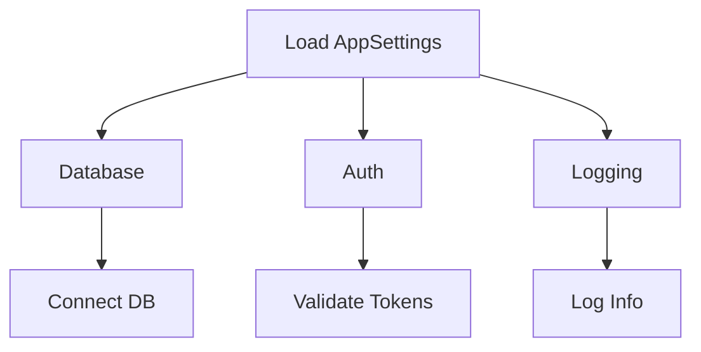

# BeerWithFriendsBackend/BeerWithFriendsBackend/appsettings.json

> Language: text | Size: 560 bytes

## Model qwen3:8b

### 1. **Purpose Summary**  
The `appsettings.json` file configures core application settings for the **BeerWithFriendsBackend** service. It defines:  
- **Logging levels** to control verbosity (e.g., `Information` for general logs, `Warning` for Microsoft.AspNetCore-related logs).  
- **Allowed hosts** (set to `*` for all domains, allowing flexible hosting).  
- **Database connection strings** for two distinct SQL Server databases:  
  - `BeerWithFriendsBackendContext` (likely for the main application data).  
  - `BeersCon` (possibly for beer-related data or a separate module).  

---

### 2. **Key Functions/Classes and Collaboration**  
- **Logging Configuration**:  
  - Sets `Default` log level to `Information` and overrides Microsoft.AspNetCore logs to `Warning`.  
  - Collaborates with ASP.NET Core's logging infrastructure (e.g., `ILogger`) to filter log output.  

- **Database Contexts**:  
  - `BeerWithFriendsBackendContext` and `BeersCon` are connection strings for Entity Framework Core (EF Core) `DbContext` classes.  
  - These contexts are used by data access layers to interact with SQL Server databases, enabling CRUD operations and queries.  

- **Hosting Configuration**:  
  - `AllowedHosts: *` allows the app to accept requests from any domain, critical for development or flexible deployment scenarios.  

---

### 3. **External Dependencies or APIs Used**  
- **SQL Server (LocalDB)**:  
  - The connection strings use `(localdb)\mssqllocaldb`, indicating reliance on SQL Server LocalDB for development/testing.  
  - Both databases (`BeerWithFriendsBackend.Data` and `BeerWithFriends`) are hosted on this local SQL Server instance.  

- **ASP.NET Core Logging Framework**:  
  - Integrates with Microsoft.AspNetCore's logging system to enforce log level filtering.  

- **Entity Framework Core**:  
  - Depends on the connection strings to establish database connections for data persistence.  

---

**Note**: No explicit external APIs (e.g., third-party services) are referenced in this file. The configuration focuses on internal infrastructure (logging, databases) and hosting settings.

## Detected Imports

None detected.

## Function Diagram

