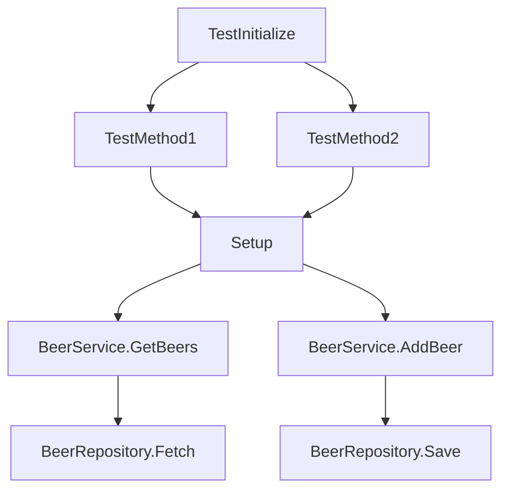

# BeerWithFriendsBackend/BeerWithFriendsTests/BeerWithFriendsTests.csproj

> Language: text | Size: 772 bytes

## Model qwen3:8b

### 1. **Purpose Summary**  
The `BeerWithFriendsTests.csproj` file defines the configuration and dependencies for a test project in the **BeerWithFriends-Back-end** repository. It specifies the target framework (`.NET 6.0`), enables nullable reference types, and sets up the project to run unit tests using **MSTest**. The project is linked to the main backend implementation (`BeerWithFriendsBackend.csproj`) and uses an in-memory database for testing via **Entity Framework Core**.

---

### 2. **Key Functions/Classes and Collaboration**  
- **Test Project Configuration**:  
  - Defines the project structure, target framework, and nullable reference types.  
  - Links to the main backend project (`BeerWithFriendsBackend.csproj`) for test coverage.  

- **Test Framework and Tools**:  
  - Uses **MSTest** (via `MSTest.TestFramework` and `MSTest.TestAdapter`) for writing and executing unit tests.  
  - Integrates **Coverlet** for code coverage analysis.  

- **In-Memory Database Testing**:  
  - Depends on `Microsoft.EntityFrameworkCore.InMemory` to simulate database operations without a real database, enabling isolated unit tests for data access layers.  

**Collaboration**:  
- The test project collaborates with the main backend project to validate business logic, data access, and API endpoints.  
- MSTest and EF InMemory work together to simulate real-world scenarios, ensuring the backend behaves correctly under test conditions.

---

### 3. **External Dependencies or APIs Used**  
- **NuGet Packages**:  
  - `Microsoft.EntityFrameworkCore.InMemory` (for in-memory database testing).  
  - `Microsoft.NET.Test.Sdk` (test framework foundation).  
  - `MSTest.TestAdapter` and `MSTest.TestFramework` (for running MSTest cases).  
  - `coverlet.collector` (for code coverage reporting).  

- **Linked Project**:  
  - `BeerWithFriendsBackend.csproj` (the main backend implementation, providing classes and logic tested by this project).  

- **.NET SDK**:  
  - Targeting `.NET 6.0` for compatibility and modern language features.  

This setup ensures tests are isolated, efficient, and aligned with the backend's architecture.

## Detected Imports

None detected.

## Function Diagram

