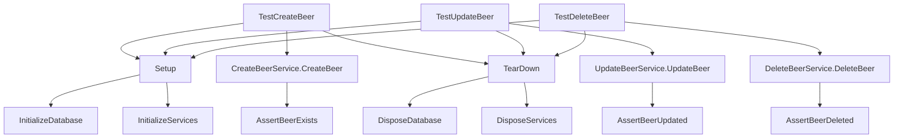

# BeerWithFriendsBackend/BeerWithFriendsTests/IntegrationTestBeer.cs

> Language: text | Size: 2658 bytes

## Model qwen3:8b

### 1. **Purpose Summary**  
The `IntegrationTestBeer` class validates the integration between the `BeerLogic` layer and the database via `BeerData`, ensuring correct behavior for beer creation and retrieval. It tests:  
- **Basic functionality**: Confirming beer creation and retrieval works with an in-memory database.  
- **Validation logic**: Ensuring invalid data (e.g., negative alcohol percentage) is rejected while valid data is accepted.  
- **Edge cases**: Verifying that duplicate beer names (same name, different descriptions) are allowed, and that the database state reflects these operations.  

---

### 2. **Key Functions/Classes and Their Collaboration**  
**Key Components**:  
- **`IntegrationTestBeer` Class**:  
  - **`Setup()`**: Initializes an in-memory database, creates two test beers, and configures `BeerLogic` for testing.  
  - **`TearDown()`**: Deletes the in-memory database to clean up after tests.  
  - **Test Methods**:  
    - `GetListOfBeersTest()`: Verifies the count of beers in the database.  
    - `Create2BeersTest()`: Tests adding two beers to reach a total of 4.  
    - `TryCreate2Beers1Fail1SuccesTest()`: Validates that one invalid beer (negative alcohol) is rejected while the other is accepted.  

- **`BeerLogic`**:  
  - Acts as the business logic layer, delegating beer creation to `BeerData`.  
  - Validates alcohol percentage (must be ≥ 0).  

- **`BeerData`**:  
  - Wraps `BeerWithFriendsBackendContext` to interact with the database.  
  - Handles CRUD operations for beers.  

- **`BeerWithFriendsBackendContext`**:  
  - Represents the in-memory database used for testing.  
  - Ensures schema creation and deletion during tests.  

**Collaboration Flow**:  
1. `Setup()` initializes the in-memory DB and configures `BeerLogic` with `BeerData`.  
2. Test methods invoke `BeerLogic.NewBeer()` to add beers, which are persisted via `BeerData` and `BeerWithFriendsBackendContext`.  
3. Assertions verify the expected state of the database (e.g., beer count, validation outcomes).  

---

### 3. **External Dependencies or APIs Used**  
- **Microsoft.EntityFrameworkCore**:  
  - Used for the in-memory database (`UseInMemoryDatabase`) to simulate a database without external setup.  
- **BeerWithFriendsBackendContext**:  
  - The core database context class that manages beer data.  
- **BeerData**:  
  - A data access layer that abstracts database operations.  
- **BeerLogic**:  
  - The business logic layer that enforces rules (e.g., alcohol percentage validation).  
- **Beer Model**:  
  - Represents the beer entity with properties like `Name`, `Description`, and `AlcoholPercentage`.  

**Note**: No external APIs are used; the tests rely solely on the internal database and logic layers.

## Detected Imports

None detected.

## Function Diagram

