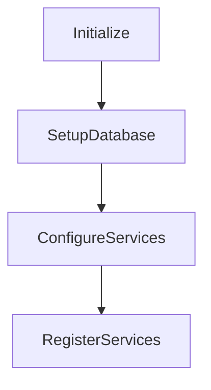

# BeerWithFriendsBackend/BeerWithFriendsTests/Usings.cs

> Language: text | Size: 58 bytes

## Model qwen3:8b

### 1. **Purpose Summary**  
The `Usings.cs` file serves to establish global namespace imports for the test project, enabling seamless integration with the **Microsoft.VisualStudio.TestTools.UnitTesting** framework. This simplifies test class and method definitions by eliminating the need to fully qualify test attributes (e.g., `[TestClass]`, `[TestMethod]`) or `Assert` methods.

---

### 2. **Key Functions/Classes and Their Collaboration**  
- **Key Class**: Test classes (defined in other files) use the imported namespace to:  
  - Mark classes as test containers with `[TestClass]`.  
  - Define test methods with `[TestMethod]`.  
  - Use `Assert` methods (e.g., `Assert.AreEqual`, `Assert.IsTrue`) to validate expected outcomes.  
- **Collaboration**:  
  - Test classes collaborate with the MSTest framework to execute test methods, manage setup/teardown, and report results.  
  - `Assert` methods act as the bridge between test logic and the framework's validation engine.  

---

### 3. **External Dependencies or APIs Used**  
- **Microsoft.VisualStudio.TestTools.UnitTesting**:  
  - Provides core testing primitives (e.g., `Assert`, `TestClass`, `TestMethod`).  
  - Required for running unit tests in the BeerWithFriends project.  
- **No other external APIs** are referenced in this file.  

--- 

**Note**: This file is foundational for the test project, ensuring all test classes and methods are properly instrumented with MSTest capabilities.

## Detected Imports

None detected.

## Function Diagram

