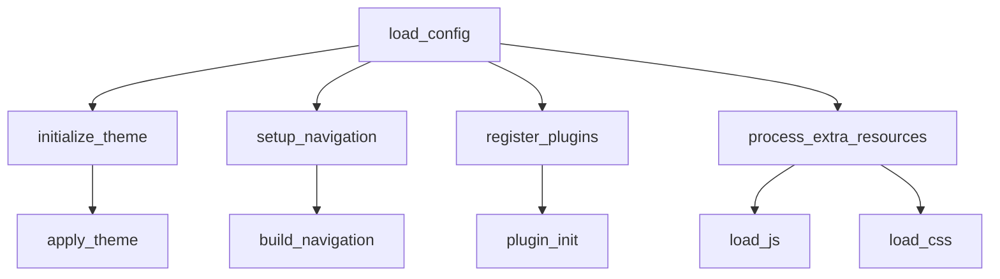

# mkdocs.yml

> Language: text | Size: 5852 bytes

## Model qwen3:8b

### 1. **Purpose Summary**  
The `mkdocs.yml` file configures the documentation site for the **BeerWithFriends-Back-end** project. It defines the structure, theme, and navigation for the documentation, enabling developers to explore the codebase, workflows, and technical files (e.g., `.csproj`, controllers, models, and test files). The configuration ensures a user-friendly interface with features like dark/light mode toggling, code annotations, and search functionality.

---

### 2. **Key Functions/Classes and Their Collaboration**  
The documentation organizes the codebase into logical sections, highlighting key components and their roles:  

- **Controllers** (`BeerController.cs`, `ReviewController.cs`):  
  Handle HTTP requests and responses, acting as the entry point for API endpoints. They interact with **data access layers** (e.g., `BeerData.cs`, `ReviewData.cs`) to retrieve or modify data.  

- **Data Access Layer** (`BeerData.cs`, `ReviewData.cs`):  
  Provide methods to query or update database records (likely using Entity Framework or similar ORM). These classes are used by **logic layers** (`BeerLogic.cs`, `ReviewLogic.cs`) to encapsulate business rules.  

- **Logic Layer** (`BeerLogic.cs`, `ReviewLogic.cs`):  
  Contain business rules and validation logic for operations like creating, updating, or deleting beers/reviews. They depend on **data access layers** and **models** (`Beer.cs`, `Review.cs`) to structure data.  

- **Models** (`Beer.cs`, `Review.cs`):  
  Define the structure of data entities (e.g., properties for beer names, ratings, etc.). These are used by controllers, data access layers, and logic layers to represent and manipulate data.  

- **Entry Point** (`Program.cs`):  
  Initializes the application, configuring services (e.g., `BeerWithFriendsBackendContext.cs` for database connections) and launching the web server.  

**Collaboration Flow**:  
`Controllers` → `Logic Layer` → `Data Access Layer` → `Database` (via `BeerWithFriendsBackendContext.cs`).  
Test files (e.g., `IntegrationTestBeer.cs`) validate these interactions using frameworks like xUnit or NUnit.  

---

### 3. **External Dependencies or APIs Used**  
- **MkDocs**: Static site generator for building the documentation.  
- **Material Theme**: Customized for dark/light mode support, code highlighting, and responsive design.  
- **Mermaid.js**: For generating diagrams (via `pymdownx.superfences` extension).  
- **.NET Core / ASP.NET**: Underlying framework for the backend (implied by `.csproj` files and C# code).  
- **Entity Framework**: Likely used for database operations (implied by `BeerWithFriendsBackendContext.cs`).  

**Note**: The `mkdocs.yml` itself does not include external APIs or code dependencies; it focuses on documentation structure. The backend code relies on .NET ecosystem tools and libraries.

## Detected Imports

None detected.

## Function Diagram

